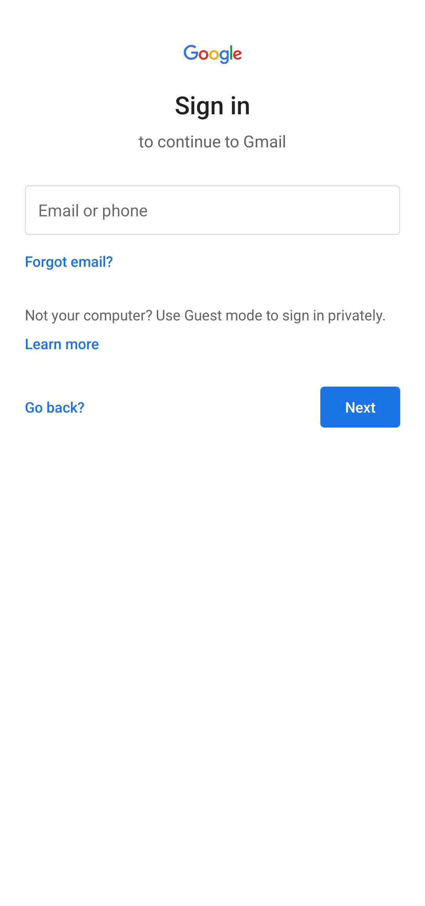
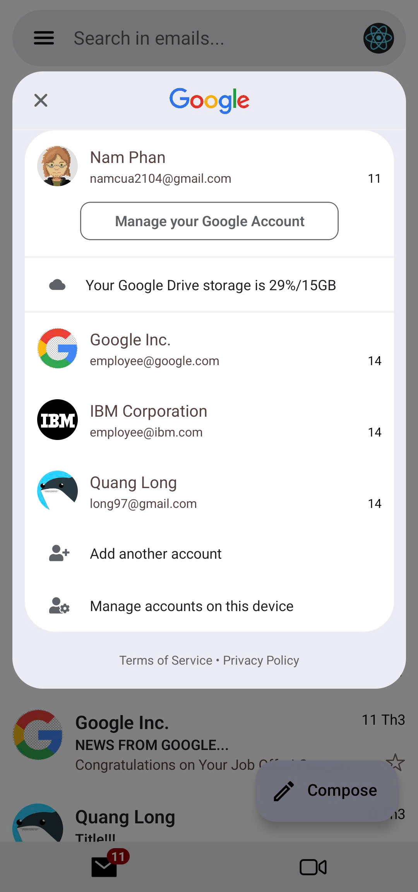
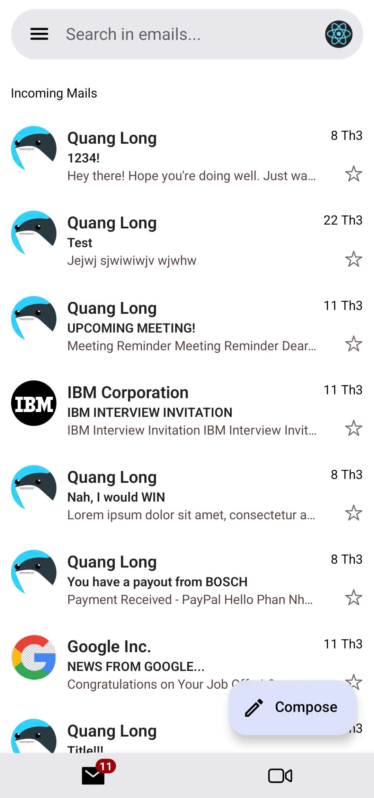
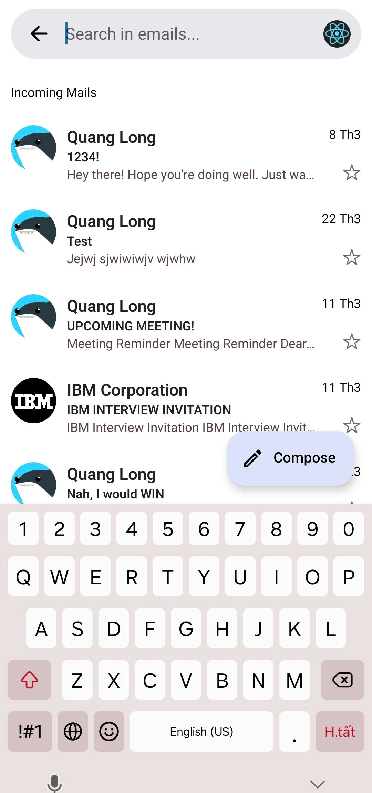
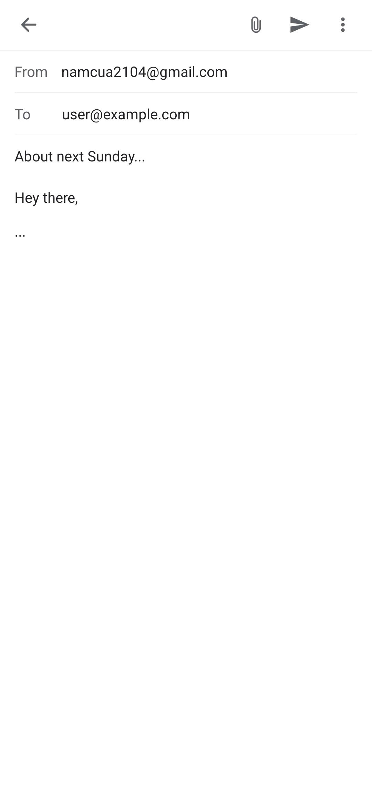
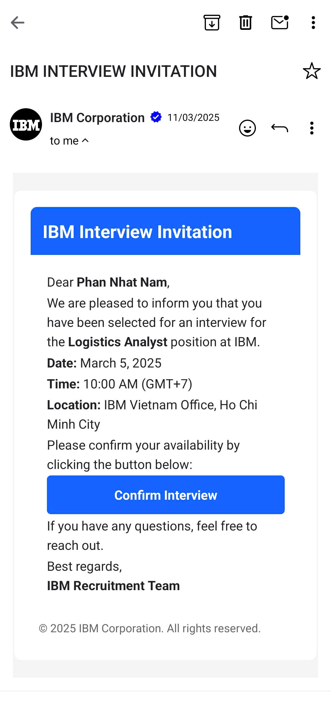

# FakeGmail

A Gmail-inspired application built with Expo.

## Screenshots and Demo

### Android Screenshots

|  |  |  |
|:--------------------------------------------------------:|:-------------------------------------------------------------:|:---------------------------------------------------:|
| *A simple sign-in page for basic login functionality*   | *Manage multiple accounts with ease*                         | *A clean and straightforward mail page design*     |

|  |  |  |
|:-----------------------------------------------------:|:------------------------------------------------------:|:-------------------------------------------------------------:|
| *A functional search bar for finding emails quickly* | *Compose emails with basic formatting options*         | *Displays HTML email content in a readable format*            |

### iOS Screenshots

iOS screenshots will be released soon. Stay tuned!

### Key Features in Action

[GIFs demonstrating key features will be added here]

## Project Overview

FakeGmail is a clone of Google's Gmail application built using Expo and React Native. The project aims to replicate the core functionality and user interface of the Gmail application while demonstrating best practices in React Native development.

## Features

- Email list view with sorting and filtering options
- Compose new emails with formatting options
- View and manage email threads
- Search functionality
- User account management
- Push notifications
- Offline support

## Technologies Used

- Expo
- React Native
- Redux (or other state management)
- React Navigation
- [Other libraries and tools]

## Installation

```bash
# Clone the repository
git clone https://github.com/yourusername/FakeGmail.git

# Navigate to the project directory
cd FakeGmail

# Install dependencies
npm install

# Start the development server
expo start
```

## Usage

To get started with FakeGmail, follow these steps:

1. **Launch the Application**  
  Start the development server using the command below, and scan the QR code with the Expo Go app on your mobile device:  
  ```bash
  expo start
  ```

2. **Sign In**  
  Use the sign-in page to enter your email address registered on Firebase. No password is required. If the email is valid on the server, you will be redirected to the mail list page.

3. **Explore Features**  
  - View your email list and try out sorting and filtering options.  
  - Compose a new email using the "Compose" button and experiment with formatting tools.  
  - Search for specific emails using the search bar.  
  - Manage multiple accounts seamlessly.

Enjoy exploring the core functionalities of FakeGmail and feel free to customize the app to suit your needs!

## Contributing

We would be thrilled if you are interested in enhancing the UI/UX of FakeGmail to better align with the real Gmail experience! Your contributions to improve the design, usability, and overall user experience are highly appreciated. Feel free to share your ideas, submit design mockups, or implement changes that bring the application closer to the polished look and feel of Gmail. Let's collaborate to make FakeGmail even better!

## License

This project is licensed under the [MIT License](LICENSE).

## About Expo

Expo is an open-source platform for making universal applications for Android, iOS, and the web with JavaScript and React. It provides a set of tools and services built around React Native that help you develop, build, deploy, and quickly iterate on iOS, Android, and web apps from the same JavaScript/TypeScript codebase.

## ⚠️ WARNING: Appropriate Use Guidelines ⚠️

This application is **STRICTLY FOR EDUCATIONAL AND DEMONSTRATION PURPOSES ONLY**. Misuse of this application may constitute fraud, identity theft, or other criminal offenses.

**STRICTLY PROHIBITED USES:**

- **DO NOT** use for phishing, impersonation, or ANY form of social engineering
- **DO NOT** deceive users into believing they are interacting with official Google services
- **DO NOT** collect personal information from individuals without explicit, informed consent
- **DO NOT** use to circumvent Google's Terms of Service or security measures
- **DO NOT** distribute modified versions that remove these warnings

**LEGAL NOTICE:** Unauthorized use of Google's trademarks, impersonation of their services, or fraudulent activities conducted with this application **WILL VIOLATE** intellectual property laws, computer fraud statutes, and privacy regulations across jurisdictions, potentially resulting in civil and criminal penalties.

## Legal Disclaimer

The creator of FakeGmail **EXPRESSLY DISCLAIMS ALL LIABILITY** for any misuse or illegal deployment of this application. By downloading, installing, or using this application, you acknowledge full understanding of these warnings and **ACCEPT COMPLETE LEGAL RESPONSIBILITY** for your implementation and use of this code. If you disagree with these terms or intend to use this application for any purpose other than legitimate education or development, **DO NOT PROCEED** with installation or use.